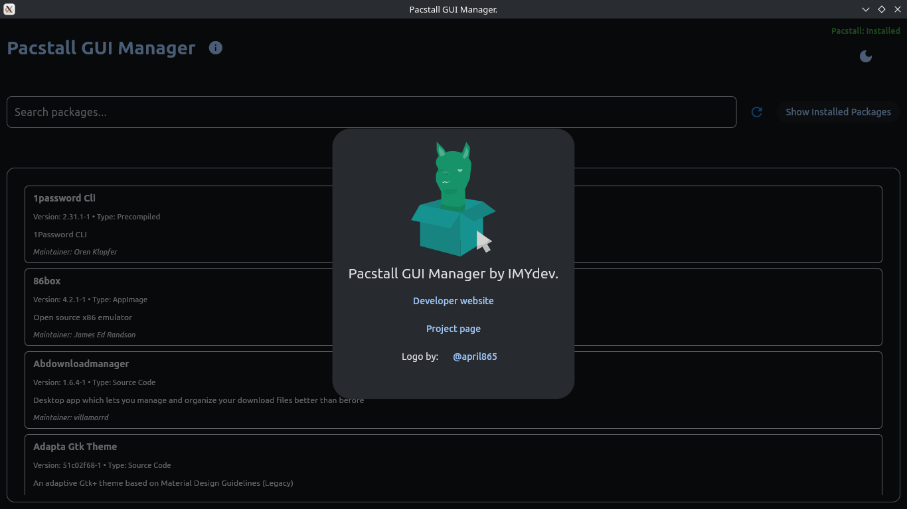

# Pacstall GUI Manager (PGM)

A modern, graphical user interface for browsing and managing [Pacstall](https://pacstall.dev) packages, built with Python and [Flet](https://flet.dev).




## About

This application provides a user-friendly way to interact with the Pacstall package repository. It aims to make pacstall more accessible for people who have terminalophobia.

## ✨ Features

- **Browse Packages**: View the entire list of available packages from the official Pacstall repository.
- **Live Search**: Instantly filter packages as you type.
- **View Package Details**: See essential information for each package, including its version, description, and maintainer.
- **Installed Package Detection**: PGM will automatically detect and mark packages that you already have installed locally.
- **Pacstall Status Check**: Immediately see if `pacstall` is detected on your system.
- **Manage Pacstall Packages**: Install/Uninstall pacakges is as easy as a few clicks.

## 🚀 Planned Features

This project is under active development. Here are some of the features we plan to add next:

- [x] ~~**Install & Uninstall Packages**: Manage packages directly from the GUI.~~
- [ ] **Update Management**: View available updates for your installed packages and update them with a single click.
- [x] ~~**Installation/Process Logging**: See the terminal output in real-time within the app when a package is being installed, updated, or removed.~~
- [x] ~~**Detailed Package View**: A dedicated page for each package with more in-depth information.~~
- [x] ~~**Theme Toggle**: Switch between light and dark modes.~~

## 🛠️ Installation

### Simply download and execute the binary from the releases page [here](https://github.com/IMYdev/PGM/releases/tag/Alpha).
## OR

1.  **Clone the repository:**
    ```bash
    git clone https://github.com/IMYdev/pgm.git
    cd pgm
    ```

2.  **Set up a virtual environment (recommended):**
    ```bash
    python -m venv .venv
    source .venv/bin/activate
    ```

3.  **Install the dependencies:**
    ```bash
    pip3 install -r requirements.txt
    ```
4.  **To run the application, simply execute the `main.py` script:**
    ```bash
    python main.py
    ```

## 🤝 Contributing

Contributions are welcome! If you have ideas for new features, bug fixes, or improvements, feel free to open an issue or submit a pull request.

## 📄 License

This project is open-source and available under the GPLv3 copyleft.
